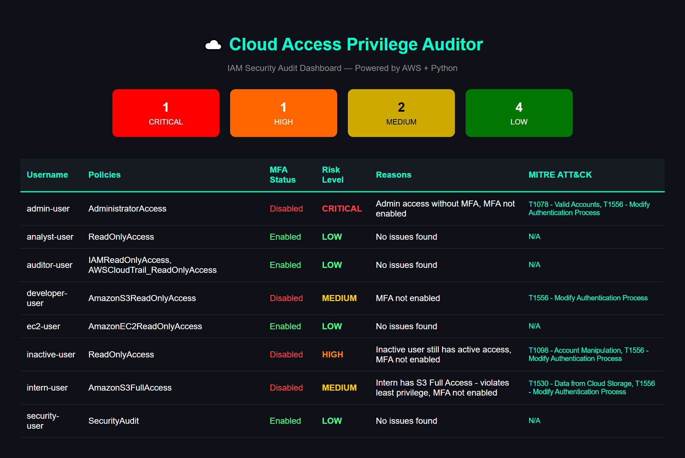

# Cloud Access Privilege Auditor

> Automated AWS IAM security auditing tool built on 
> Zero Trust and Least Privilege principles.

---

## Overview

Organizations accumulate IAM risk silently — orphaned accounts, 
missing MFA on privileged users, interns with full S3 access. 
This tool surfaces those risks automatically, classifies them 
by severity, and maps each finding to the MITRE ATT&CK framework.

Built as a practical alternative to manual IAM reviews.

---

## Dashboard




## Project Structure

```
cloud-access-auditor/
├── auditor.py            # IAM scanner and risk classification
├── app.py                # Flask dashboard
├── requirements.txt      # Dependencies
└── templates/
    └── dashboard.html    # Dashboard UI
```


## Stack

- **Python 3 + Boto3** — IAM enumeration and risk logic
- **AWS IAM + CloudTrail** — data source
- **Flask** — audit dashboard
- **OpenPyXL** — Excel report generation
- **AWS EC2** — production deployment

---


##  Setup and Installation

### Prerequisites
- Python 3.x
- AWS Account with IAM permissions
- AWS CLI configured

### Install dependencies
```bash
pip install boto3 flask openpyxl
```

### Configure AWS credentials
```bash
aws configure
```

### Run the auditor
```bash
python auditor.py
```

### Run the dashboard
```bash
python app.py
```


---

##  EC2 Deployment

The dashboard is deployed on AWS EC2 for continuous monitoring:

1. Launch EC2 instance (Amazon Linux 2023, t2/t3.micro)
2. Configure security groups for port 22 and 5000
3. Upload project files via SCP
4. Install dependencies on EC2
5. Run dashboard accessible via public IP

---

##  Real World Use Case

This tool simulates a real organizational IAM audit scenario with:
- 8 IAM users representing different job roles
- Varying permission levels per role
- Mixed MFA enforcement
- Intentional misconfigurations for detection testing

---

## Security Practices

All AWS credentials are managed exclusively through the AWS CLI 
(`aws configure`) and never hardcoded in source code. The tool 
operates under an IAM user with scoped, least-privilege permissions 
— access limited strictly to what the auditor requires and nothing 
beyond that.

Credentials follow the same Zero Trust principle the tool enforces: 
minimum access, no standing privileges, rotated after use.

